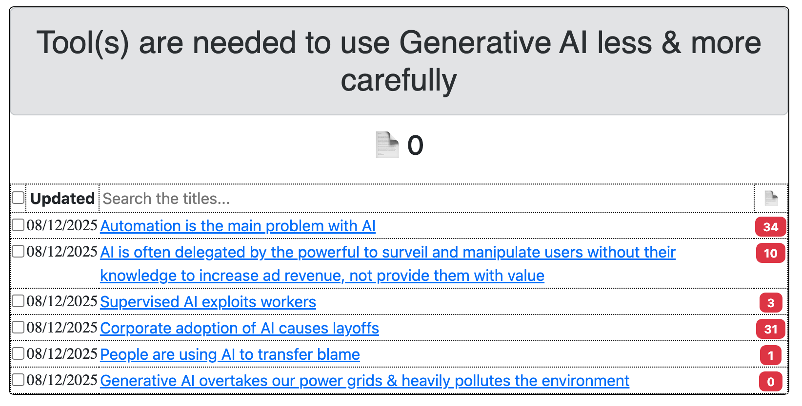
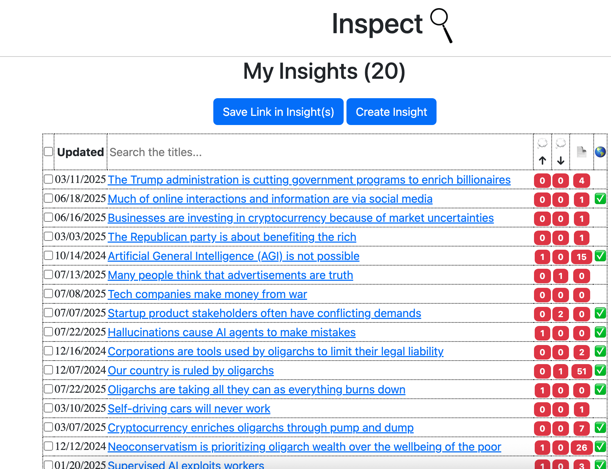

# 🔍 inspect

**The core Next.js platform engine rendering Bayesian causal networks, graph slices, and system dependencies.**

`inspect` is Datagotchi Labs' flagship visual platform. It maps complex systems into explicit $a \rightarrow b$ Bayesian causal networks, allowing teams to visualize root causes, audit evidence-backed claims, and navigate operational dependencies without black-box token waste.




---

## 🎯 The Friction & The Solution

Modern organizations suffer from **cognitive fragmentation** and **untraceable system logic**:
* **Opaque Dependencies:** Claims, system states, and business decisions are isolated across siloed tools with zero traceable evidence chain.
* **Unvalidated Logic:** Black-box LLM outputs invent connections rather than exposing verified causal links.
* **Data Enclosure:** Graph intelligence and analytics are routinely locked behind vendor APIs.

**`inspect` solves this by:**
1. Modeling operational logic as **explicit, directed Bayesian causal networks**.
2. Rendering graph slices ($a \rightarrow b$) so users can isolate specific root-cause paths.
3. Anchoring claims and nodes directly to verifiable source evidence.

---

## 🏗️ System Architecture & Data Schema

```mermaid
graph LR
    A[Source Content / Evidence] --> B(Summaries)
    B --> C[Insights / Subjective Claims]
    C -->|Hierarchical / Causal Links| D{Bayesian Network Engine}
    D -->|Render Slices| E[Next.js Interactive UI]
    
    style D fill:#2b2b2b,stroke:#00ffcc,color:#fff
    style E fill:#1f1f1f,stroke:#ff0055,color:#fff
